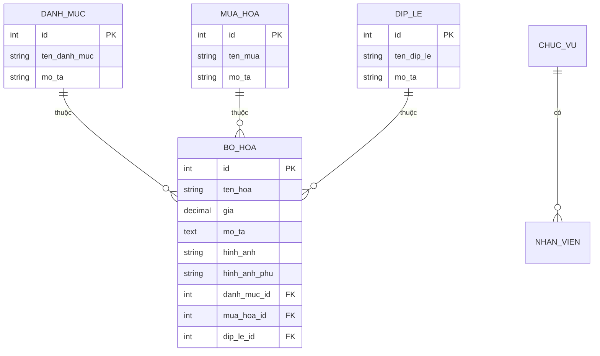

<div align="center">

# 🌸 Flower Shop Backend API


<br><br>

**🌺 RESTful API Backend cho hệ thống thương mại điện tử cửa hàng hoa**

*Xây dựng với Laravel 12 • Kiến trúc API chuẩn RESTful • Bảo mật với Sanctum*

<br>

[📖 Tài liệu](#-tài-liệu) •
[🚀 Cài đặt](#-cài-đặt) •
[⚡ API Reference](#-api-reference) •
[🛠️ Công nghệ](#️-công-nghệ)

</div>

---

## ✨ Tổng quan

**Flower Shop Backend** là hệ thống API backend hoàn chỉnh cho nền tảng thương mại điện tử cửa hàng hoa. Được thiết kế với kiến trúc RESTful, hệ thống cung cấp các tính năng quản lý sản phẩm, danh mục, tin tức và nhân viên một cách hiệu quả.

### 🎯 Tính năng chính

<table>
<tr>
<td width="50%">

#### 🛒 Quản lý Sản phẩm
- CRUD đầy đủ cho sản phẩm hoa
- Hỗ trợ nhiều hình ảnh sản phẩm
- Phân loại theo danh mục, mùa, dịp lễ
- Lọc và tìm kiếm nâng cao

</td>
<td width="50%">

#### 👥 Quản lý Hệ thống
- Quản lý nhân viên và phân quyền
- Hệ thống đăng nhập admin
- Quản lý danh mục và tin tức
- API cho cả Admin và Client

</td>
</tr>
</table>

---

## 🛠️ Công nghệ

<div align="center">

| Công nghệ | Phiên bản | Mô tả |
|-----------|-----------|-------|
|  | 12.x | PHP Framework hiện đại |
|  | 8.2+ | Ngôn ngữ lập trình |
|  | 8.0 | Cơ sở dữ liệu |
|  | 4.x | Xác thực API |

</div>

---

## 📁 Cấu trúc dự án

```
BE_Flowershop/
├── 📂 app/
│   ├── 📂 Http/
│   │   └── 📂 Controllers/     # API Controllers
│   ├── 📂 Models/              # Eloquent Models
│   │   ├── BoHoa.php           # Model sản phẩm hoa
│   │   ├── DanhMuc.php         # Model danh mục
│   │   ├── DipLe.php           # Model dịp lễ
│   │   ├── MuaHoa.php          # Model mùa hoa
│   │   ├── NhanVien.php        # Model nhân viên
│   │   ├── TinTuc.php          # Model tin tức
│   │   └── ...
│   └── 📂 Providers/
├── 📂 config/                  # Cấu hình ứng dụng
├── 📂 database/
│   ├── 📂 migrations/          # Database migrations
│   └── 📂 seeders/             # Database seeders
├── 📂 routes/
│   ├── api.php                 # API routes
│   └── web.php                 # Web routes
├── 📂 storage/                 # Lưu trữ files
└── 📂 public/                  # Public assets
```

---

## 🚀 Cài đặt

### Yêu cầu hệ thống

- **PHP** >= 8.2
- **Composer** >= 2.x
- **MySQL** >= 8.0
- **Node.js** >= 18.x (tùy chọn)

### Hướng dẫn cài đặt

```bash
# 1. Clone repository
git clone https://github.com/HoDuongQuocHuy278/Flowershop-BE.git
cd Flowershop-BE

# 2. Cài đặt dependencies
composer install

# 3. Tạo file .env
cp .env.example .env

# 4. Tạo application key
php artisan key:generate

# 5. Cấu hình database trong file .env
# DB_DATABASE=flowershop
# DB_USERNAME=your_username
# DB_PASSWORD=your_password

# 6. Chạy migrations
php artisan migrate

# 7. Seed dữ liệu mẫu (tùy chọn)
php artisan db:seed

# 8. Khởi động server
php artisan serve
```

Server sẽ chạy tại `http://localhost:8000`

---

## ⚡ API Reference

### 🔐 Admin APIs

<details>
<summary><strong>📦 Quản lý Sản phẩm (Bó hoa)</strong></summary>

| Method | Endpoint | Mô tả |
|--------|----------|-------|
| `GET` | `/api/admin/bo-hoa/get-data` | Lấy danh sách sản phẩm |
| `POST` | `/api/admin/bo-hoa/add-data` | Thêm sản phẩm mới |
| `POST` | `/api/admin/bo-hoa/update-data` | Cập nhật sản phẩm |
| `POST` | `/api/admin/bo-hoa/delete-data` | Xóa sản phẩm |

</details>

<details>
<summary><strong>📂 Quản lý Danh mục</strong></summary>

| Method | Endpoint | Mô tả |
|--------|----------|-------|
| `GET` | `/api/admin/danh-muc/get-data` | Lấy danh sách danh mục |
| `POST` | `/api/admin/danh-muc/add-data` | Thêm danh mục mới |
| `POST` | `/api/admin/danh-muc/update-data` | Cập nhật danh mục |
| `POST` | `/api/admin/danh-muc/delete-data` | Xóa danh mục |

</details>

<details>
<summary><strong>🌿 Quản lý Mùa hoa</strong></summary>

| Method | Endpoint | Mô tả |
|--------|----------|-------|
| `GET` | `/api/admin/mua-hoa/get-data` | Lấy danh sách mùa hoa |
| `POST` | `/api/admin/mua-hoa/add-data` | Thêm mùa hoa mới |
| `POST` | `/api/admin/mua-hoa/update-data` | Cập nhật mùa hoa |
| `POST` | `/api/admin/mua-hoa/delete-data` | Xóa mùa hoa |

</details>

<details>
<summary><strong>🎉 Quản lý Dịp lễ</strong></summary>

| Method | Endpoint | Mô tả |
|--------|----------|-------|
| `GET` | `/api/admin/dip-le/get-data` | Lấy danh sách dịp lễ |
| `POST` | `/api/admin/dip-le/add-data` | Thêm dịp lễ mới |
| `POST` | `/api/admin/dip-le/update-data` | Cập nhật dịp lễ |
| `POST` | `/api/admin/dip-le/delete-data` | Xóa dịp lễ |

</details>

<details>
<summary><strong>📰 Quản lý Tin tức</strong></summary>

| Method | Endpoint | Mô tả |
|--------|----------|-------|
| `GET` | `/api/admin/tin-tuc/get-data` | Lấy danh sách tin tức |
| `POST` | `/api/admin/tin-tuc/add-data` | Thêm tin tức mới |
| `POST` | `/api/admin/tin-tuc/update-data` | Cập nhật tin tức |
| `POST` | `/api/admin/tin-tuc/delete-data` | Xóa tin tức |

</details>

<details>
<summary><strong>👨‍💼 Quản lý Nhân viên</strong></summary>

| Method | Endpoint | Mô tả |
|--------|----------|-------|
| `GET` | `/api/admin/nhan-vien/get-data` | Lấy danh sách nhân viên |
| `POST` | `/api/admin/nhan-vien/add-data` | Thêm nhân viên mới |
| `POST` | `/api/admin/nhan-vien/update-data` | Cập nhật nhân viên |
| `POST` | `/api/admin/nhan-vien/delete-data` | Xóa nhân viên |
| `POST` | `/api/admin/dang-nhap` | Đăng nhập admin |

</details>

### 🌐 Client APIs

| Method | Endpoint | Mô tả |
|--------|----------|-------|
| `GET` | `/api/client/home-page` | Lấy dữ liệu trang chủ |
| `GET` | `/api/client/bo-hoa` | Danh sách sản phẩm (có filter) |
| `GET` | `/api/client/bo-hoa/{id}` | Chi tiết sản phẩm |
| `GET` | `/api/client/danh-muc` | Danh sách danh mục |
| `GET` | `/api/client/mua-hoa` | Danh sách mùa hoa |
| `GET` | `/api/client/mua-hoa/{id}` | Sản phẩm theo mùa |
| `GET` | `/api/client/dip-le` | Danh sách dịp lễ |
| `GET` | `/api/client/dip-le/{id}` | Sản phẩm theo dịp lễ |

---

## 📊 Database Schema



---

## 🔧 Cấu hình

### Biến môi trường (.env)

```env
# Application
APP_NAME="Flower Shop API"
APP_ENV=local
APP_DEBUG=true
APP_URL=http://localhost:8000

# Database
DB_CONNECTION=mysql
DB_HOST=127.0.0.1
DB_PORT=3306
DB_DATABASE=flowershop
DB_USERNAME=root
DB_PASSWORD=

# CORS (cho phép frontend truy cập)
FRONTEND_URL=http://localhost:5173
```

---

## 📝 Các lệnh hữu ích

```bash
# Chạy development server
php artisan serve

# Chạy migrations
php artisan migrate

# Rollback migrations
php artisan migrate:rollback

# Fresh migrations (xóa và tạo lại)
php artisan migrate:fresh --seed

# Tạo controller
php artisan make:controller TenController

# Tạo model với migration
php artisan make:model TenModel -m

# Clear cache
php artisan cache:clear
php artisan config:clear
php artisan route:clear
```

---

## 🤝 Đóng góp

Chúng tôi hoan nghênh mọi đóng góp! Vui lòng:

1. **Fork** repository này
2. Tạo **branch** mới (`git checkout -b feature/TinhNangMoi`)
3. **Commit** thay đổi (`git commit -m 'Thêm tính năng mới'`)
4. **Push** lên branch (`git push origin feature/TinhNangMoi`)
5. Tạo **Pull Request**

<div align="center">

### 🌺 Made with ❤️ by FlowerShop Team

<br>

**[⬆ Về đầu trang](#-flower-shop-backend-api)**

</div>
